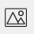
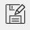

# Basic field types and their properties #

## Common control properties ##

There are several properties which works the same for almost all controls (exceptions are "Nested table" and Label control):

> * ***Caption*** – sets name of a field visible on a form and in the table caption.

> * ***Caption Format*** – sets Caption font family, size (in points) and style (*bold*, *italic*, *underline*).

> * ***Name used in formulas*** – sets name of a field that is used to refer to this field in formulas.

> > [!TIP]
> We recommend giving meaningful and informative formula names. It will help you select the needed field name when writing expressions. For example, if your field is used to display product description, set name for formulas as *product_description*.

Another common property is "Default value", which is available at some controls (it's mentioned if supported):

> * ***Default value*** – the value which is used to automatically fill in control when new record is added.

Text format defines text format for the textual controls (it's mentioned if supported):

> * ***Text format*** - sets text font family, size (in points) and style (*bold*, *italic*).

## String ##

String is used to add text values to the database, for example names, products, description, services. Any text information can be added.

The following string properties are available:

> * ***[Common properties](#common-control-properties)***

> * ***Default value*** is supported

> * ***Enable barcode input*** – if checked you will be able to scan barcodes to enter values in this field.

> * ***Text format*** - sets text font family, size (in points) and style (*bold*, *italic*).

## Label ##

Label is used to add text information that is equal for all entries in the database. It can be used to add a caption to the card, so that you are able to see what information you are going to add or edit. You can also use it to name some group of fields: contact information, product details, etc.

The following Label properties are available:

> * ***Text*** – sets text of a label displayed on a form.

> * ***Alignment*** – sets text alignment in the control. (top left, top center, top right, center left, center, center right, bottom left, bottom center, bottom right).

> * ***Text format*** – sets text font family, size (in points) and style (*bold*, *italic*, *underline*).

## Float ##

Float is used to enter and display decimal numbers.

The following Float properties are available:

> * ***[Common properties](#common-control-properties)***

> * ***Default value*** is supported

> * ***Text format*** - sets text font family, size (in points) and style (*bold*, *italic*).

## Integer ##

Integer is used to enter and display integer values.

The following Integer properties are available:

> * ***[Common properties](#common-control-properties)***

> * ***Default value*** is supported

## Bool ##

Bool (Boolean) is used to add checkboxes to a database. It has two states: checked and unchecked. This field can be edited from both card and table view.

The following Bool properties are available:

> * ***[Common properties](#common-control-properties)***

> * ***Default value*** is supported

## Date ##

Date is used enter and display dates. A user is able to select some date by selecting it in the date picker.

The following Date properties are available:

> * ***[Common properties](#common-control-properties)***

> * ***Default value*** is supported

> * ***Set current date as default*** – if checked sets current date by default or every new entry.

> * ***Custom format*** – sets custom date format. It set, for example, in the following manner: **dd-MM-yyyy, MM/dd/yyyy, dd.MM.yyyy**, etc.  **“y” – Year, “M” – Month, “d” – Day**. The number of letters means the number of figures displayed.

> * ***Text format*** - sets text font family, size (in points) and style (*bold*, *italic*).

## Time ##

Time is used to enter and display time. A user is able to select time by selecting it in the time picker.

The following Time properties are available:

> * ***[Common properties](#common-control-properties)***

> * ***Show seconds*** – if checked time value shows seconds.

> * ***Set current time by default*** – if checked sets current time for every new entry.

> * ***Text format*** - sets text font family, size (in points) and style (*bold*, *italic*).

## Picture ##

Picture is used to add and display images in a card. Picture can be selected from the gallery or cloud storage  , or taken by the device camera  . It’s also possible to delete the image from the card  or save it outside of the app for further use 

The following Picture properties are available:

> * ***[Common properties](#common-control-properties)***

## Hyperlink ##

Hyperlink is used to enter and display hyperlinks. The hyperlinks shown on the form is active. By tapping on it users gets to the web browser that opens the specified web page.

The following hyperlink properties are available:

> * ***[Common properties](#common-control-properties)***

> * ***Default value*** is supported

> * ***Enable barcode input*** - if checked you will be able scan barcodes to enter values in this field.

> * ***Text format*** - sets text font family, size (in points) and style (*bold*, *italic*).

## Email ##

Email is used to enter and display emails. Email shown on a form is active. By tapping on it a user gets to an email client and is able to send a message to the selected recipient.

The following Email properties are available:

> * ***[Common properties](#common-control-properties)***

> * ***Default value*** is supported

> * ***Enable barcode input*** - if checked you will be able scan barcodes to enter values in this field.

> * ***Text format*** - sets text font family, size (in points) and style (*bold*, *italic*).

## Phone ##

Phone is used to enter and display phone numbers. Upon pressing the corresponding icon in a card a user is able to dial the number via one of the dialer apps.

The following Phone properties are available:

> * ***[Common properties](#common-control-properties)***

> * ***Default value*** is supported

> * ***Enable barcode input*** - if checked you will be able scan barcodes to enter values in this field.

> * ***Text format*** - sets text font family, size (in points) and style (*bold*, *italic*).

## Rating ##

Rating provides an intuitive rating experience that allows users to select the number of stars that represents their rating.

The following Rating properties are available:

> * ***[Common properties](#common-control-properties)***

> * ***Default value*** is supported

> * ***Maximum value*** – sets maximum possible rating value.

> * ***Step*** – sets step for increment or decrement of rating. The default step is 1.

> * ***Text format*** - sets text font family, size (in points) and style (*bold*, *italic*).

## Address ##

Address is used to enter and display physical address information.

The following Address properties are available:

> * ***[Common properties](#common-control-properties)***

> * ***Show country*** – if checked information about country is visible and can be added or edited.

> * ***Show region*** – if checked information about region is visible and can be added or edited.

> * ***Show city*** – if checked information about city is visible and can be added or edited.

> * ***Show postal code*** - if checked information about postal code is visible and can be added or edited.

> * ***Show address line 1*** – if checked address line 1 is visible and can be added or edited.

> * ***Show address line 2*** – if checked address line 2 is visible and can be added or edited.

> * ***Set current country as default*** – sets country selected in the Language and Input setting of a device.

> * ***Text format*** - sets text font family, size (in points) and style (*bold*, *italic*).

## Currency ##

Currency is used to enter and display money units.

The following Currency properties are available:

> * ***[Common properties](#common-control-properties)***

> * ***Default value*** is supported

> * ***Currency sign*** – sets sign to denote the currency.

> * ***Currency sign place*** – sets if the currency sign should be placed before or after the numeric value.

> * ***Text format*** - sets text font family, size (in points) and style (*bold*, *italic*).

## Dropdown list ##

Dropdown can be used as a simplified version of the table reference control. It is a replacement for single column table reference.

> [!NOTE]
> Values are not stored in the separate table as in table reference control, they are stored as is inside the column. It also doesn't reset when value is removed from the list.

The following Dropdown list properties are available:

> * ***[Common properties](#common-control-properties)***

> * ***Sort values*** – if checked indicates if the entries should be sorted.

> * ***Value list*** – a simple list editor for values available in the dropdown. It's possible to access list editor not only from the form designer but during filling in values in the form view.

> * ***Text format*** - sets text font family, size (in points) and style (*bold*, *italic*).

## Table reference ##

Table reference is used to add relation to the other table in the database. It is used when you need to show some data from the other table in the designed card. It’s also used to avoid duplicate entries and saves time on filling in a card. A user is able to proceed to the related table entry by tapping the corresponding icon in a card, edit some information and get back to the table he was working with.

The following Table Reference properties are available:

> * ***[Common properties](#common-control-properties)***

> * ***Table*** – allows selecting a table to refer to from the list of all tables in the database.

> * ***Column*** – allows selecting a column to refer to from a list of all columns of the table selected on a previous step.

> * ***Sort values*** – if checked indicates if the entries should be sorted.

> * ***Text format*** - sets text font family, size (in points) and style (*bold*, *italic*).

> * ***Dependency filter*** - allows to filter combobox values based on another combobox. Can be used when cascade grouping is used. More detailed explanation is available in the following [article](./filtered_dropdown.md).

>   * ***Current table relation*** - specifies combobox of the current form which is used for filtering purposes.
>   * ***Parent relation controls*** - links filtering combobox with combobox from parent table. In order to filter there should be the same table relation to the same table in current table as well as in parent table. By linking them we filter current relation and show only values which corresponds to "current table relation"

More information regarding this control can be found in the following [article](./table_rel.md).

## Calculable ##

Calculable is used display data that is a result of some expression calculation. More information on available functions and fields that can be used in formulas is available in the following [article](./use_exp.md).

The following Calculable properties are available:

> * ***[Common properties](#common-control-properties)***

> * ***Expression*** – sets formula that needs to be calculated to display the value in this field.

> * ***Format*** – sets format of the calculated value. If a user selects some value different from *“None”* additional options become available. It’s offered to select *Number* or *Percentage Format*. *Decimal numbers* allows to specify number of decimal places to use for number format.

> * ***Prefix*** – will add some data before the calculated value (for example currency sign).

> * ***Postfix*** – will add some data after the calculated value (for example currency sign).

> * ***Presentation*** – sets type of the calculated value. The default value type is Text. (Can be: Text, Checkbox, Hyperlink, Email, Phone, Picture, File).

## Location ##

Location is used to enter and display coordinates of a place. Coordinates can be entered manually in the following format: *53.389175;83.745387*, or you can get your current coordinates with GPS and add them to a card 
Users are also able to view the place specified by the entered coordinates on the map 

The following Location properties are available:

> * ***[Common properties](#common-control-properties)***

> * ***Text format*** - sets text font family, size (in points) and style (*bold*, *italic*).

> * ***Marker expression*** - sets formula for the text used in the marker's popup message on the map.

## Nested table ##

Nested table is used to insert a child table into the card. This is very convenient for storing additional data that is related to a definite entry but adding it to the card would overload it and make unreadable.

The following Nested table properties are available:

> * ***[Common properties](#common-control-properties)***

> * ***Show as link*** – if checked a nested table will be represented by a hyperlink.

> * ***Columns settings*** – provides access to the list of columns where a user can manage columns visibility and order.

Nested table layout and columns are created and managed in the same manner as the parent table. Users can access nested table designer in two ways: by tapping the icon  in the designer.

## Attached file ##

Attached file control allows to add file (blob) data to the database. It could be documents (pdf, docx, xlsx) and any other file types.

> [!NOTE]
> Files are stored inside the database. They are not a link to the file in the file system. When you attach file it's copied to the database.

The following Attached file properties are available:

> * ***[Common properties](#common-control-properties)***

> * ***Text format*** - sets text font family, size (in points) and style (*bold*, *italic*).

## Related fields ##

In the designer toolbox you will see another group of elements below the described controls. You will see a list of all fields from the related tables referred by field caption. You can simply drag and drop any such field to the form. A calculable control with the pre-set expression will be added and calculable type will be automatically specified. The expression has the following look:  *client.email*, where *client* is a "Name to use in formulas" of the Table relation control that makes reference to the selected table and *email* is the name of the column (field) in this table.  Such fields have all properties of a Calculable field.
