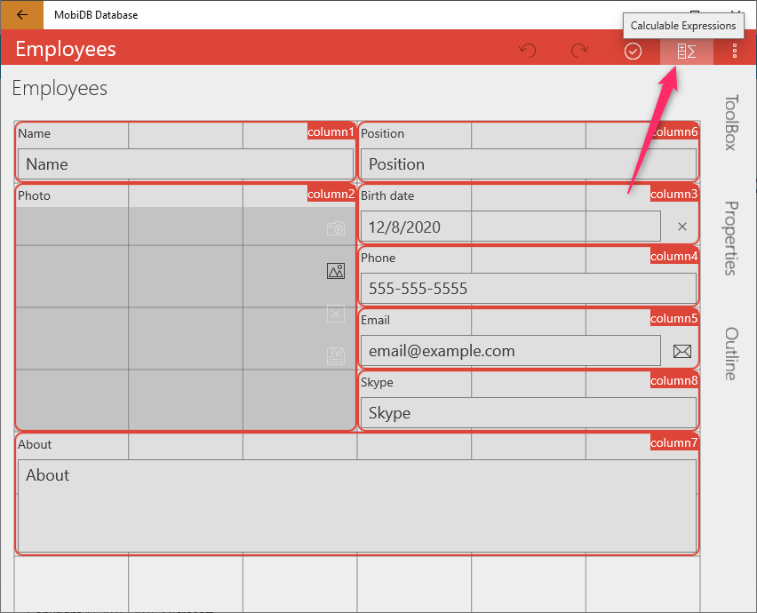
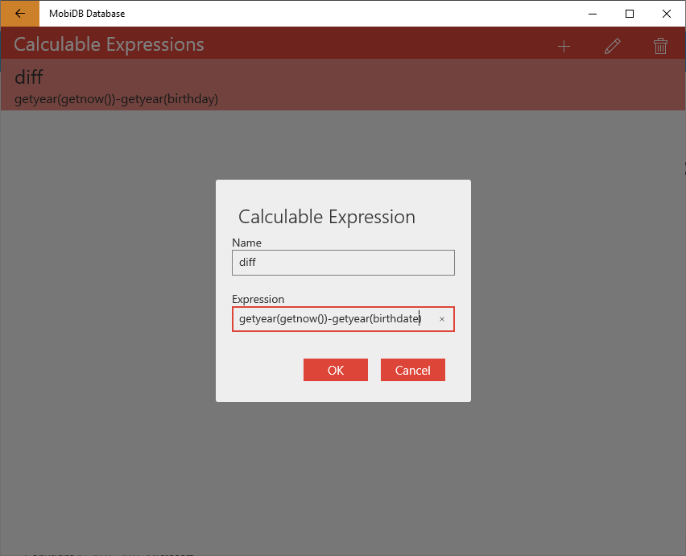
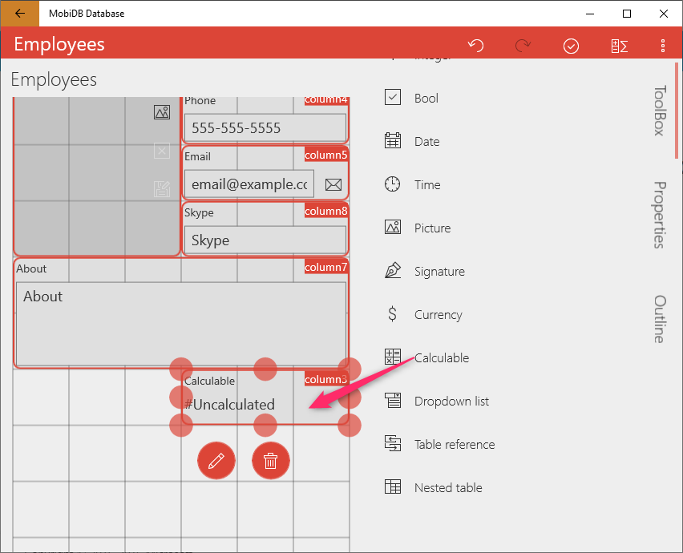
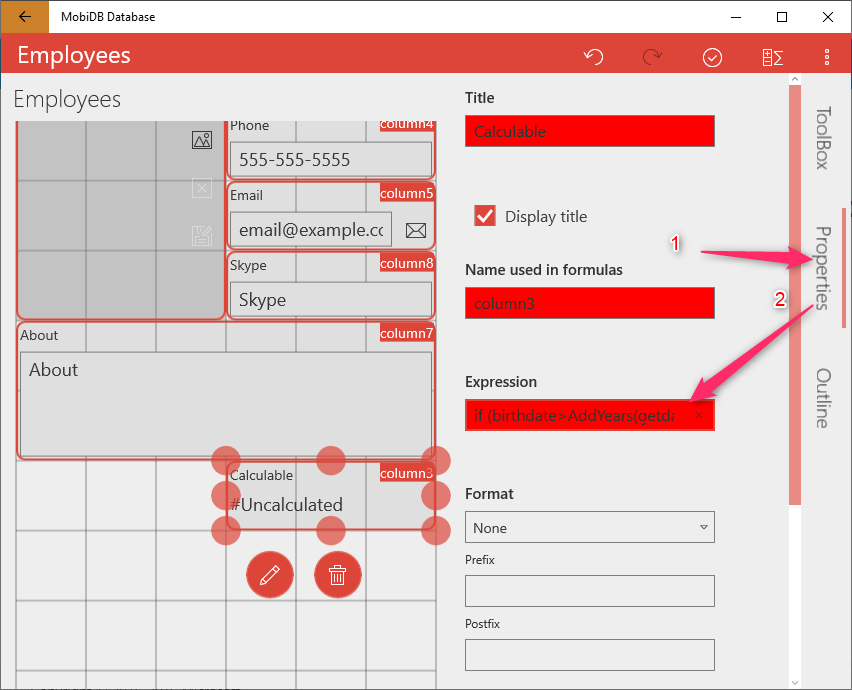
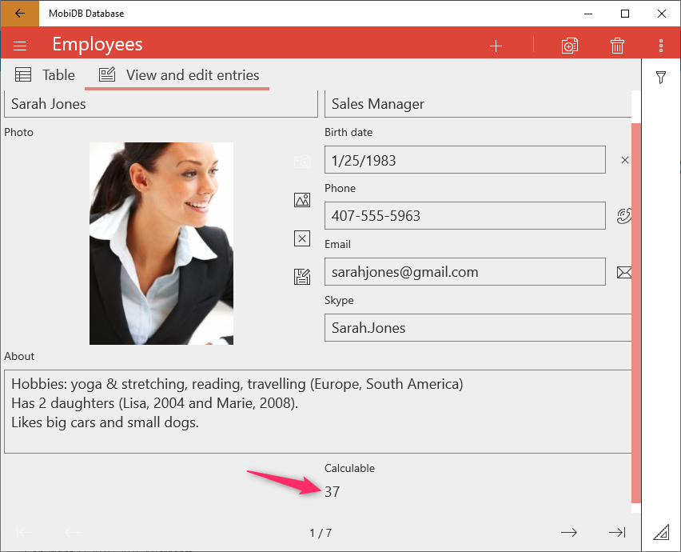

# How to calculate age in MobiDB database

Based on the following [link](https://stackoverflow.com/a/1404/1099716) you need to add [calculable expression](../field_types/calc_exp.md) in the designer:

Add the following expression called `diff`:

`getyear(getnow())-getyear(birthday)`

And add the following expression to the calculable field:

`if (birthday>AddYears(getdate(getnow()),-diff),diff-1,diff)`

Result:

Example can be found [here](../../examples/age.pdmd).
