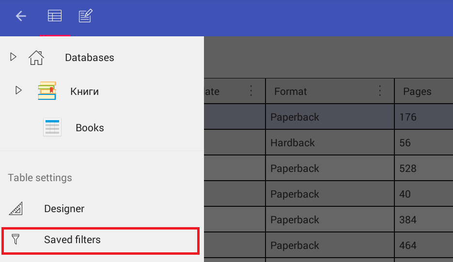
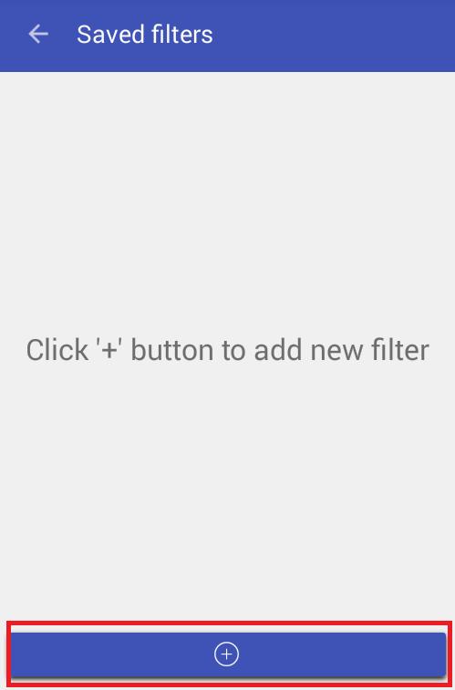
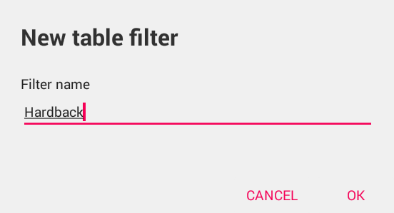
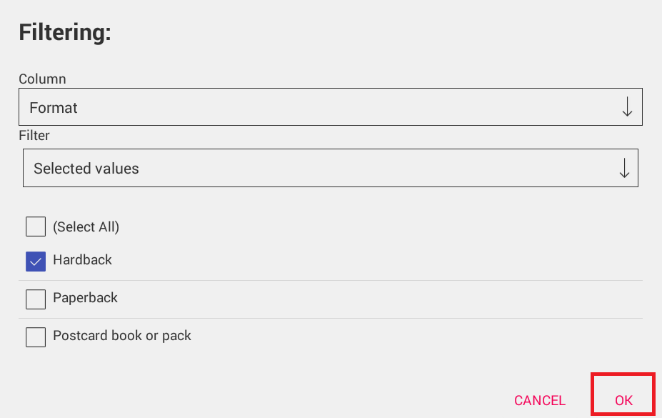
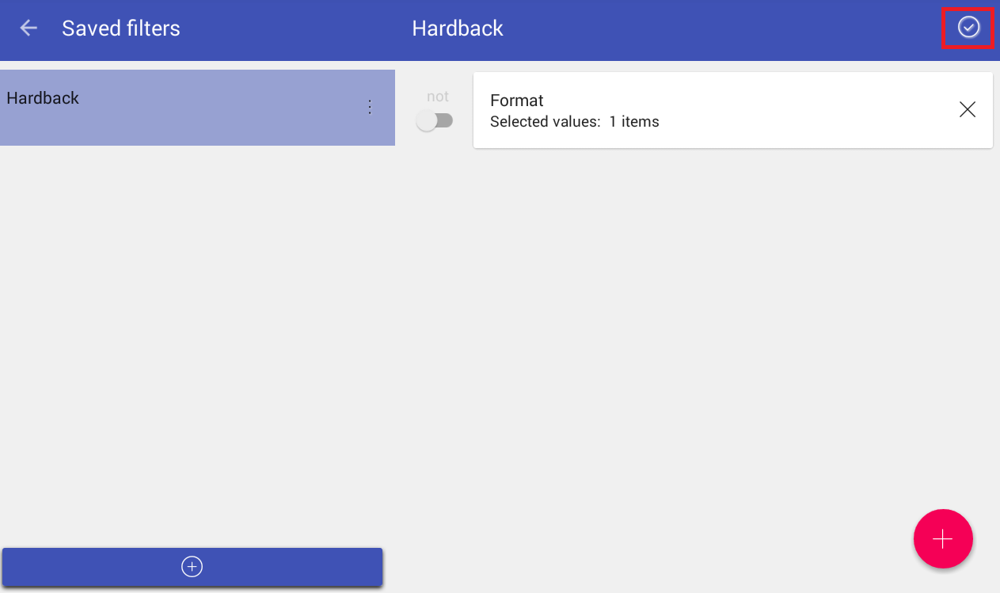
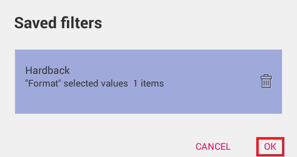
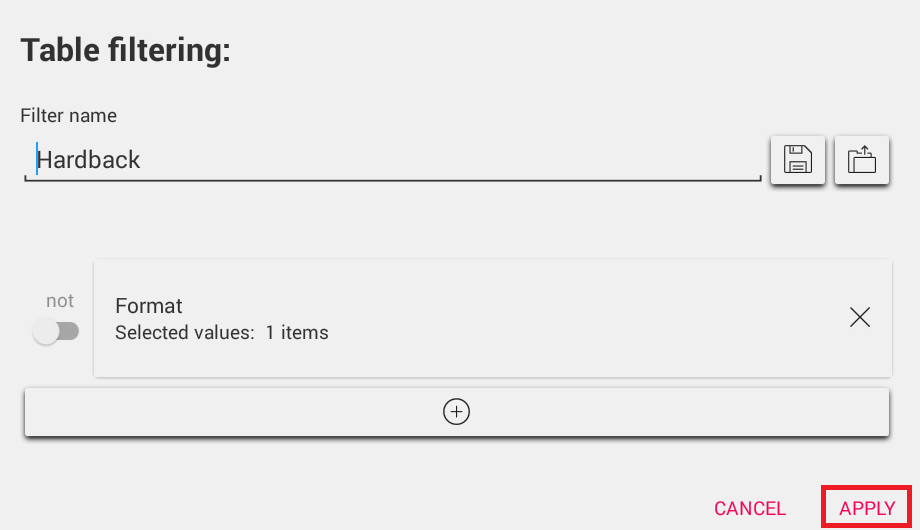
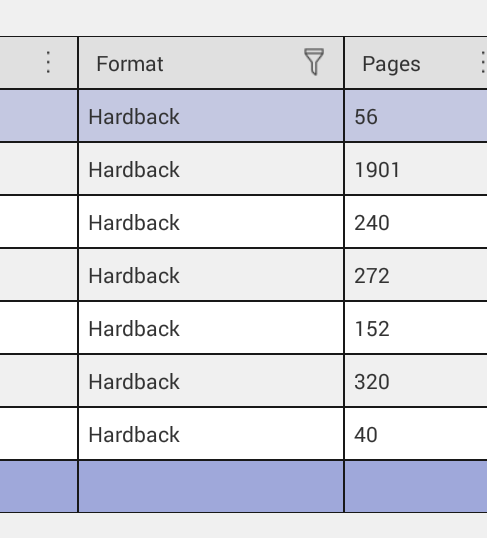

# Saved filters #

The following article displays how to save the filter for further use within a table.

1) Tap on the main menu icon and select **Saved filters** from the Table settings options

2) Tap on the **+** (plus sign) button to add a new filter

3) Set the filter name and press **OK** to confirm.

4) Tap on the **+** (plus sign) button in the corner to specify the filter settings.

5) After the filter settings for the column are set, press **OK** to confirm the changes.

6) Then, press the tick mark in the upper right corner to save the filter.

7) To select the saved filter click **Filtering** option from the column **Sort and filter** menu

8) Tap on the filter selection icon to view the available filters

9) Select the filter by tapping on it and press **OK** to confirm filter selection.

10) Then press **Apply** to use the filter.

11) The filter is applied and the filtered values are displayed.

