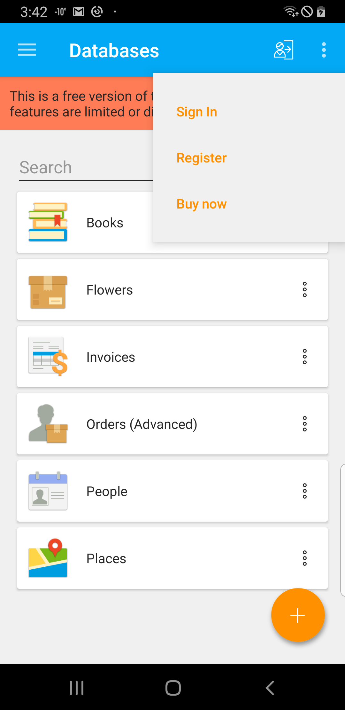
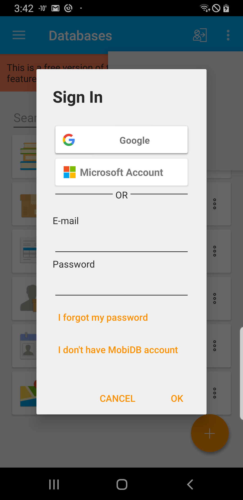
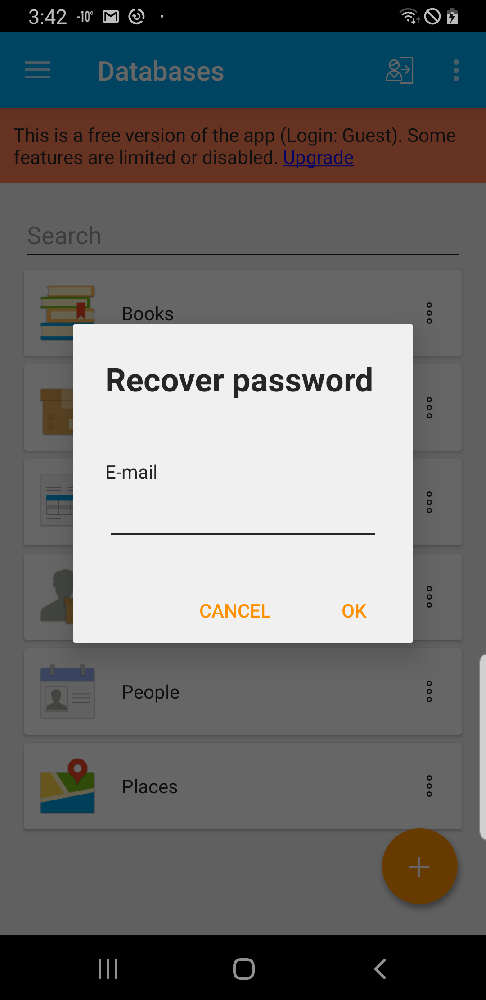
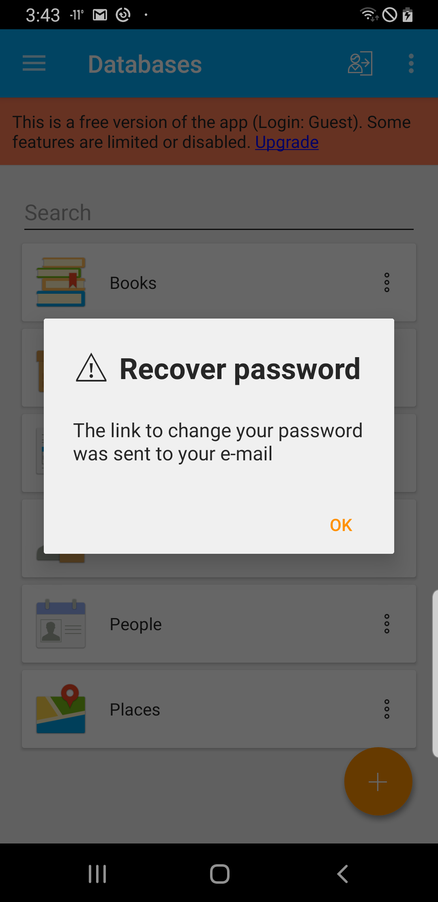
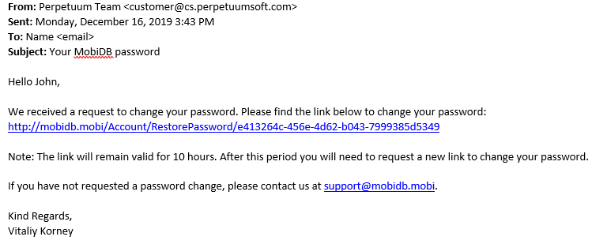
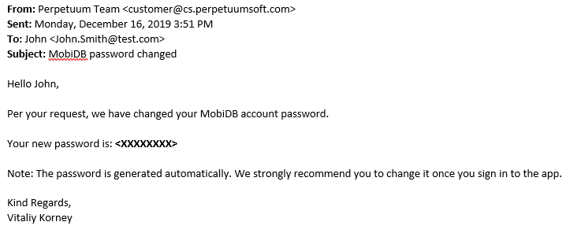

# I forgot my password #

In order to change password which you don't remember open account menu:

Choose **Sign In** option.

You'll see login screen. Tap on **I forgot my password** link.

Specify recovery email:

And hit OK.

Check you mail box:

Click on restore password **link**.

You will see the following screen:

And finally you will get email with new password:

