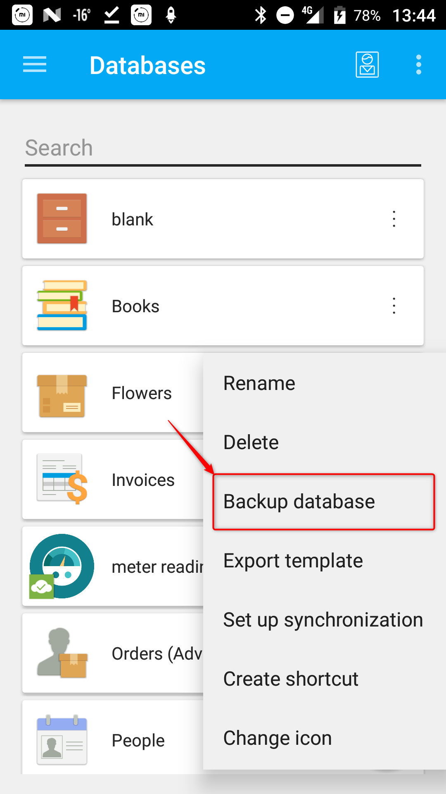
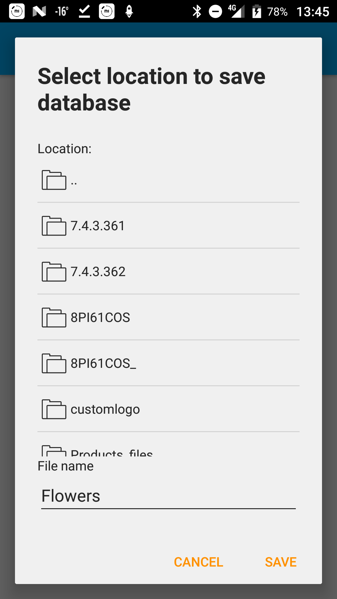
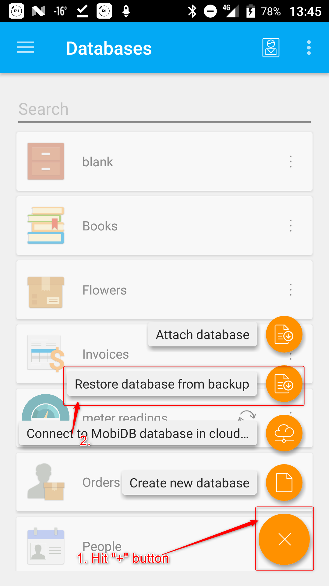
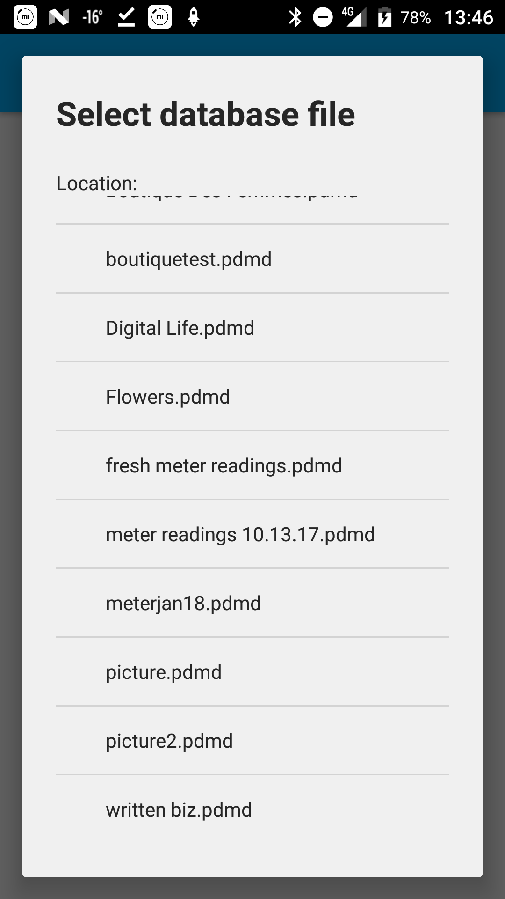
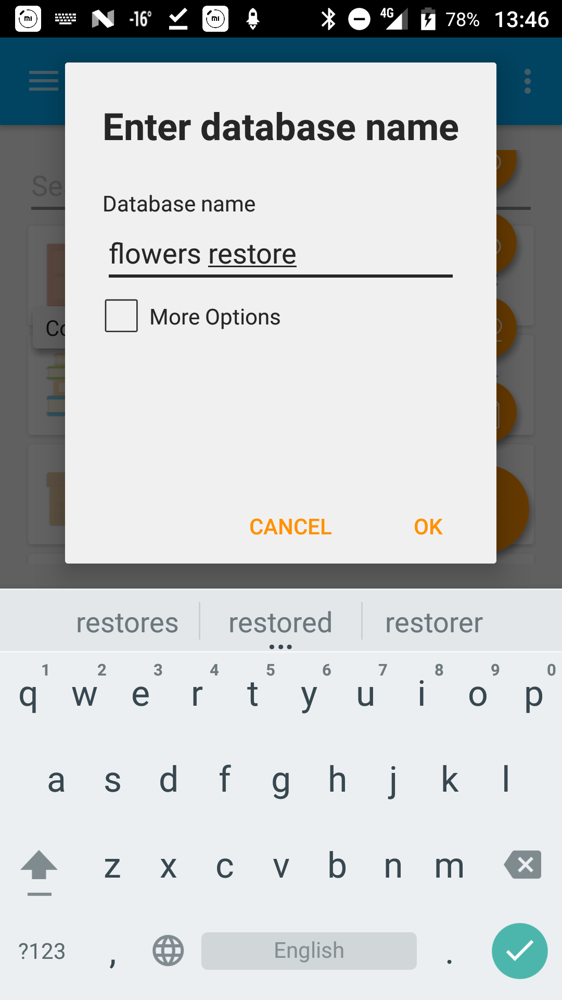
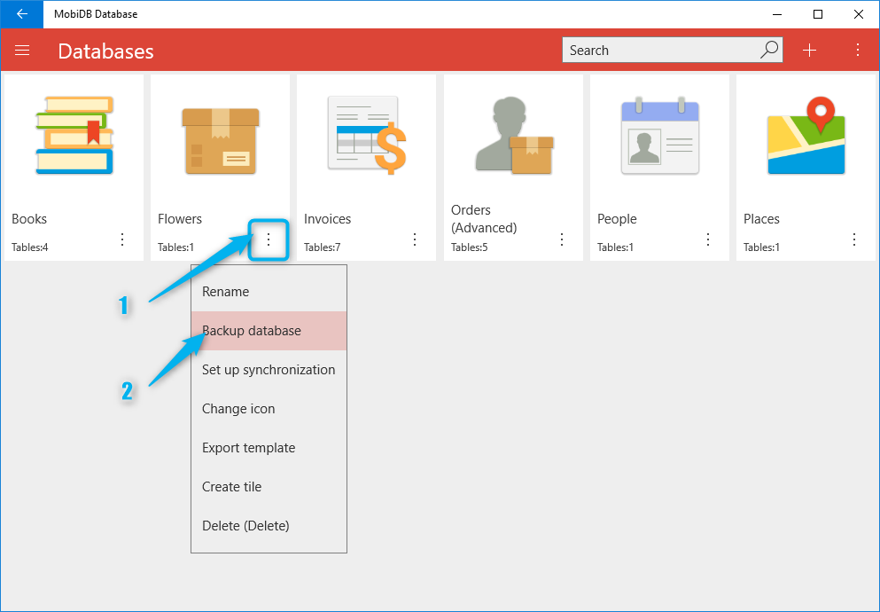
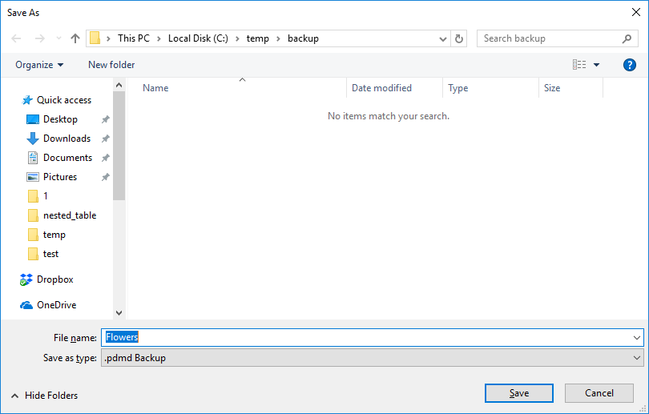
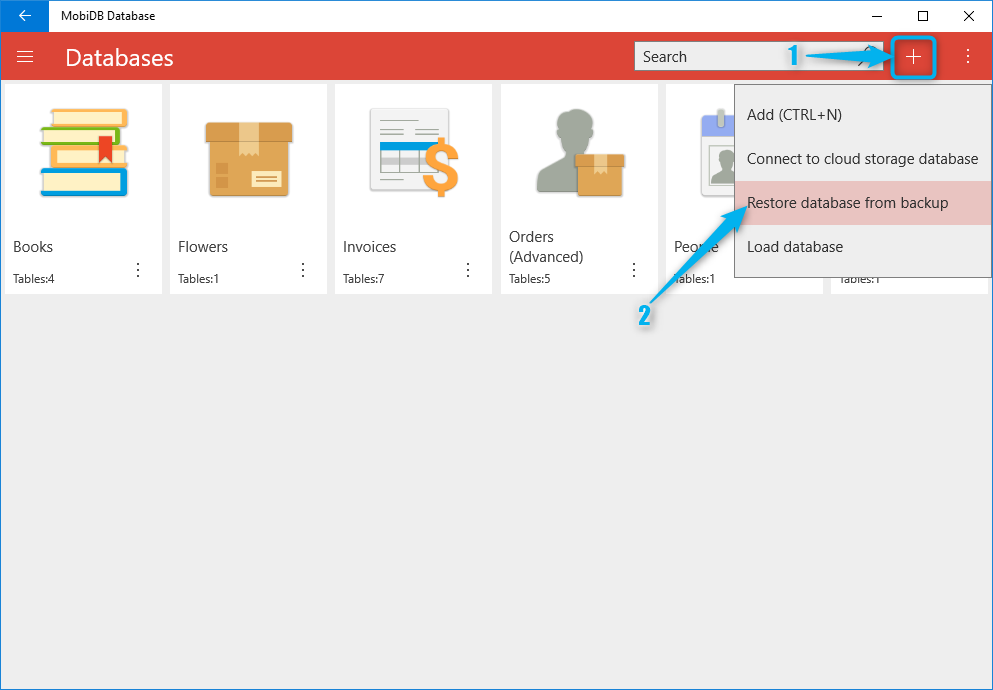
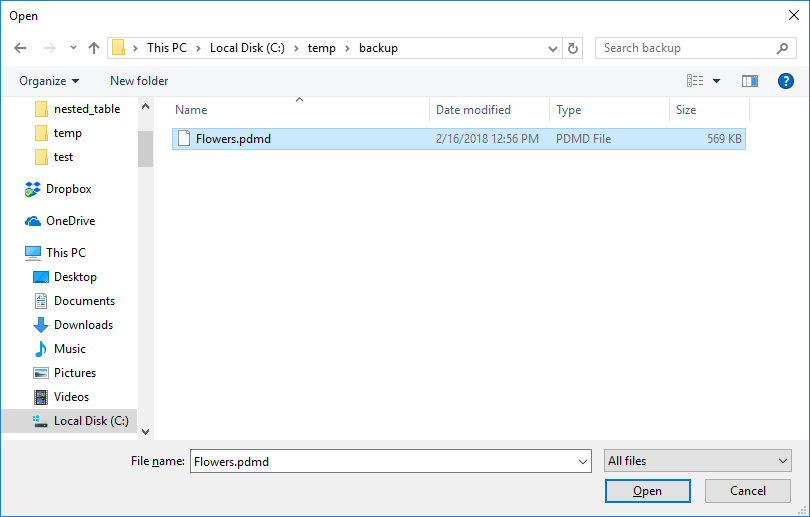
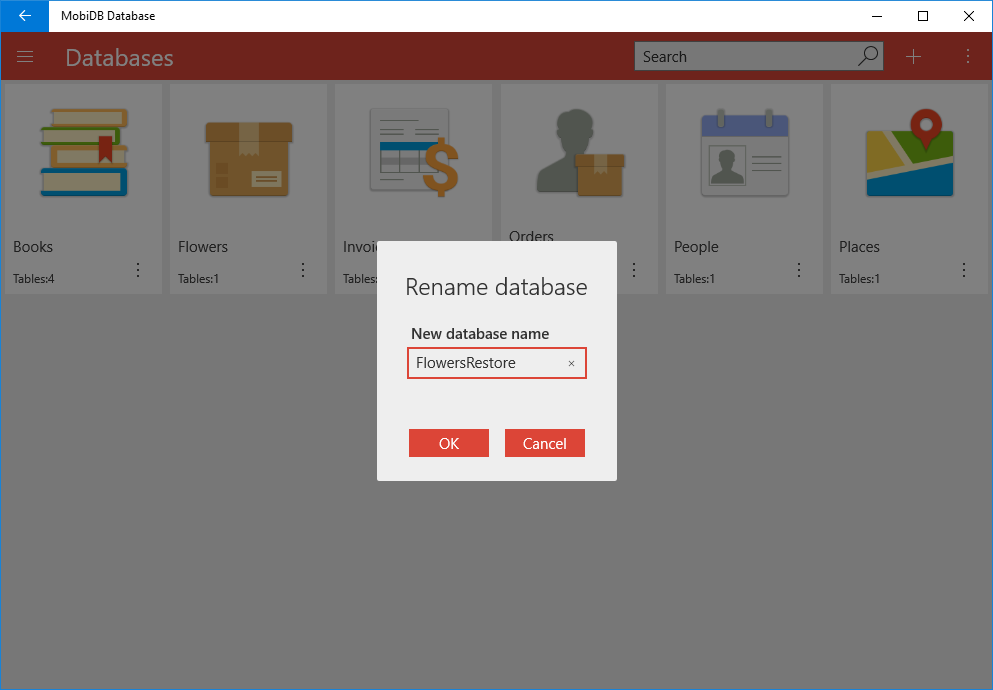

# Backup and restore

## Android

### Backup

In order to backup database open database options and choose backup database:

Specify path for the backup and hit SAVE:

### Restore

In order to restore backup hit plus button and choose restore:

Specify backup file:

Specify database name:

## Windows

### Backup

In order to backup database open database options and choose backup database:

Specify path for the backup:

### Restore

In order to restore backup hit plus button and choose restore:

Specify backup file and hit open:

Specify db name:

