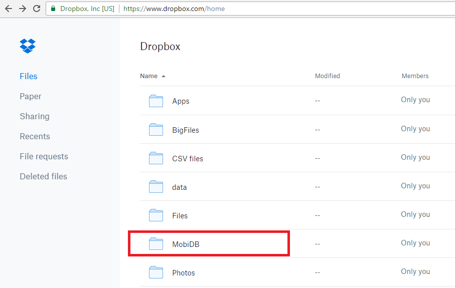
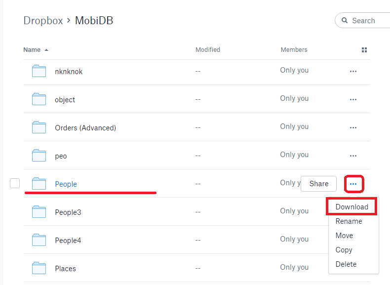

# Save data from Dropbox #

Sometimes, the support team may ask you to provide the contents of your database Dropbox folder in order to examine the synchronization problems that occur on your device. One of the essential conditions is that the requested files should not have the creation timestamp modified and that is why we strongly recommend using the method shown below to preserve the timestamps from being altered.

1)  Run your favorite web-browser and type http://dropbox.com in the address bar. Sign in under your Dropbox account and navigate to MobiDB folder.

2) Open MobiDB folder by clicking on it, then click the context menu icon of the database folder and select 'Download' option.
This will zip the database folder content into a single file without modifying the files timestamps.

