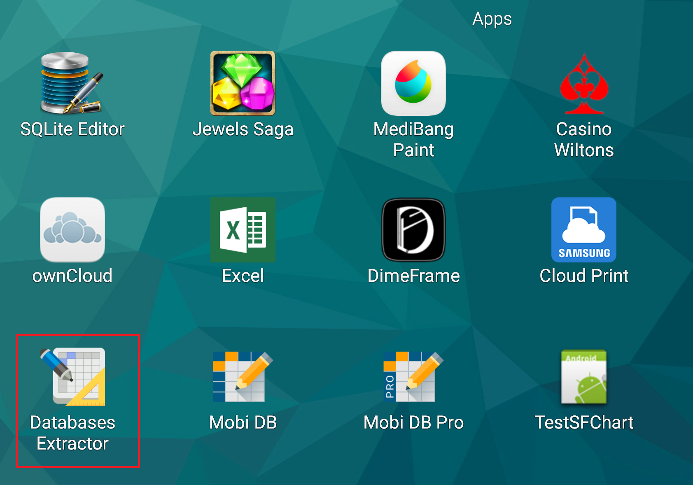
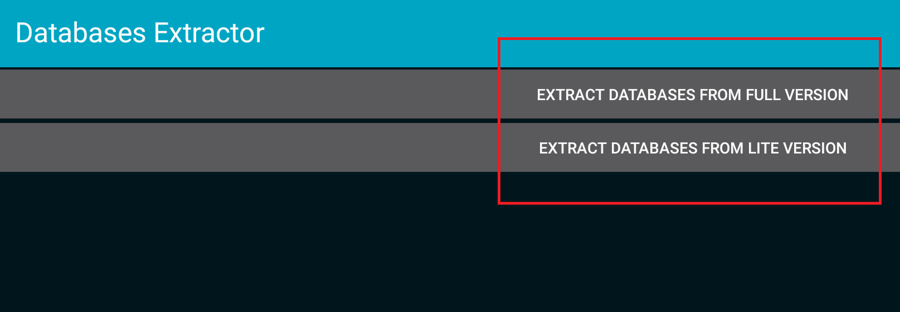
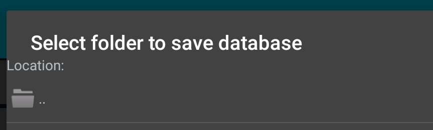
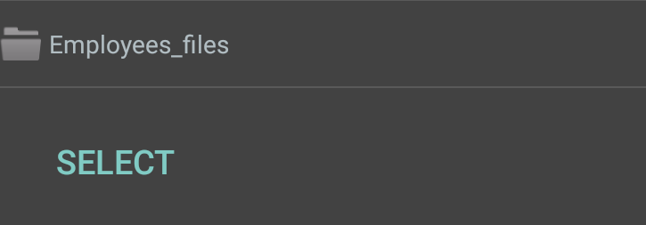
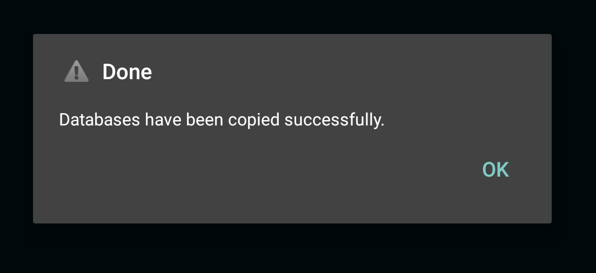

# Database Extractor tool #

Sometimes, the support team may ask you to extract the MobiDB database files in order to examine the problems that occur on your device. The requested .db files are stored in a private directory of the application and are not directly accessible unless you are using a root account. That's why we recommend using our Databases Extractor tool to extract the database files on a non-rooted device.

Please follow the steps below to get the .db files extracted on your device:

1) Download the Databases Extractor tool using the link below:

https://mobidb.mobi/downloads/databaseextractor.apk

Use any available archive tool to unzip the apk installer and install it to your device.

2) Run the Databases Extractor and select the installed MobiDB version

 

3) Specify the path to save the .db files to..

..and tap 'Select' button to confirm.

If everything was done correctly you will see the following window.

5) Navigate to the file path you specified in step 3 to check the .db files. In case no files were saved to the folder,
then most probably you selected the wrong MobiDB version in step 2. Select another MobiDB version and try again.
